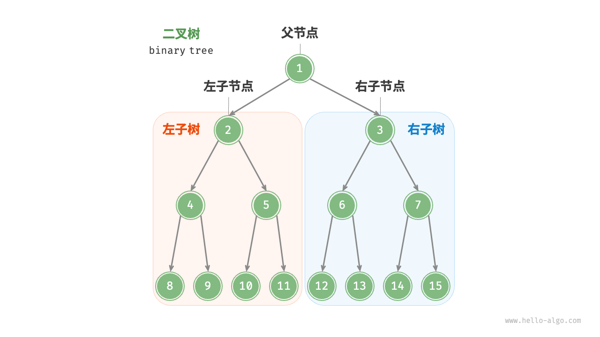

# dfs

## dfs 介绍

dfs 即 深度优先搜索（depth first search），是搜索的手段之一。

比如要遍历/搜索下面的树，dfs 会先搜下面的左子节点，左子节点再搜左子节点...直到搜索到叶子

在搜索完成后再搜索右子节点。。搜索结束后再返回上一个节点

顺序：1->2->4->8->9...

（相对的，如果是按一层一层搜的话，就叫 bfs 即 广度优先搜索）



根据深度优先搜索的特点，使用递归函数实现比较简单。

（如果要自己实现，则需要一个栈来保存上下文。编程语言的调用栈自动实现了这个过程）

## 理解递归

什么是递归？
简单来说就是在函数里调用自己。

实现递归函数有两个要点：

- 每次调用自己时要**缩小范围**
- 函数要有**终止条件**

怎么理解上面的话，我来举一个计算阶乘的例子：`n! = n \* (n-1)!`

```py
def fact(n: int):
  # 设置终止条件
  if n == 0:
    return 1
  # 缩小范围
  return n * fact(n - 1)
```

## 例子

### 排列组合

[1, 2, 3, 4] 的所有排列组合

```py
visited = [0, 0, 0, 0] # 表示使用过数字
result = [0, 0, 0, 0]  # 排列组合数字

def dfs(depth: int):
    # 要有终止条件
    if depth == 4:
        print(result)
        return
    for i in range(4):
        if not visited[i]:
            visited[i] = 1
            result[depth] = i + 1
            # 缩小范围
            dfs(depth + 1)
            visited[i] = 0

dfs(0)
# [1, 2, 3, 4]
# [1, 2, 4, 3]
# [1, 3, 2, 4]
# [1, 3, 4, 2]
# [1, 4, 2, 3]
# [1, 4, 3, 2]
# ...
```

### 拆解整数

将 8 拆成 3 个整数，输出所有分法

```py
result = [0, 0, 0]

def dfs(depth: int, rest: int):
    if depth == 2:
        result[depth] = rest
        print(result)
        return
    for i in range(1, rest):
        result[depth] = i
        dfs(depth + 1, rest - i)

dfs(0, 8)
```

## Python 迭代器

结合 yield 来实现打印排列组合 `[1,2,3,4]`

```py
def list_perm(depth: int, nums: list[int]):
    if depth == 4:
        yield nums
    else:
        for num in [1, 2, 3, 4]:
            nums.append(num)
            for result in list_perm(depth + 1, nums):
                yield result
            nums.pop()

# 返回迭代器，需要消费
for x in list_perm(0, []):
    print(x)
```

## 练习

- [二叉树的中序遍历](https://leetcode.cn/problems/binary-tree-inorder-traversal/description/)
- [图像渲染](https://leetcode.cn/problems/flood-fill/description)

## 参考资料

- https://oi-wiki.org/search/dfs/
- https://www.hello-algo.com/chapter_graph/graph_traversal/#932
